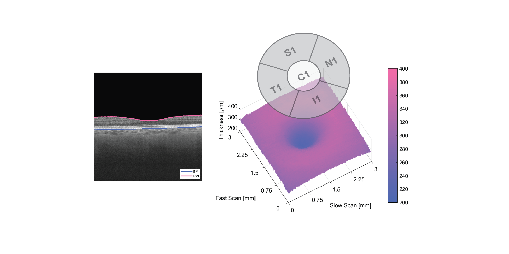

# retinaMaps
The 'drusenM1' algorithm uses segmentation data to characterize the space between the retinal pigment epithelium (RPE) and Bruch’s membrane (BM).  Area and volume values corresponding to ETDRS subfieds are provided in table format.<br/>
The algorithm is designed to be executed following the execution of 'segPLEX' (https://github.com/cnzakimuena/segPLEX).  Previously processed folders from 'segPLEX' (e.g. for ‘SamplePatient_01’, ‘SamplePatient_02’, etc.) each containing a 'Results' subfolder should be inserted into a 'processed' folder.  The 'processed' folder should be located inside the current directory (sample input dataset: https://www.kaggle.com/cnzakimuena/retinal-oct-and-octa-data-3).<br/>

usage:

```matlab
call_drusenM1()
```

Cite As

Bélanger Nzakimuena, C. (2020). Automated Analysis of Retinal and Choroidal OCT and OCTA Images in AMD (Masters thesis, Polytechnique Montréal). Retrieved from https://publications.polymtl.ca/5234/


